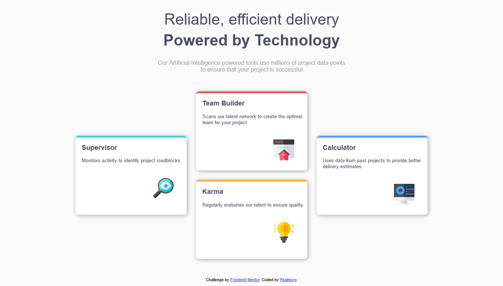

# Frontend Mentor - Four card feature div solution

This is a solution to the [Four card feature div challenge on Frontend Mentor](https://www.frontendmentor.io/challenges/four-card-feature-div-weK1eFYK). Frontend Mentor challenges help you improve your coding skills by building realistic projects. 

## Table of contents

- [Overview](#overview)
  - [The challenge](#the-challenge)
  - [Screenshot](#screenshot)
  - [Links](#links)
- [My process](#my-process)
  - [Built with](#built-with)
  - [What I learned](#what-i-learned)
  - [Continued development](#continued-development)
  - [Useful resources](#useful-resources)
- [Author](#author)
- [Acknowledgments](#acknowledgments)


## Overview

### The challenge

Users should be able to:

- View the optimal layout for the site depending on their device's screen size

### Screenshot
#### For Desktop Preview


#### For Mobile Preview


### Links

- Solution URL: [Add solution URL here](https://github.com/Psalmorg/four-card-feature-section-master)
- Live Site URL: [Add live site URL here](https://psalmorg.github.io/four-card-feature-section-master/)

## My process

### Built with

- Semantic HTML5 markup

- CSS Grid

### What I learned

During the process of attempting this challenge, i learnt:
- about how to use ```clamp``` for responsive ```font-size```
```css
h1 {
    font-size: clamp(1.5rem,-0.0545rem + 4.444vw, 2.5rem);
}
```
- more  about ```grid``` and its ```properties: grid-template-column grid-row grid-column gap```


### Continued development

During the course of this project, i learnt about ```grid``` and ```clamp``` for responsive ```font-size```. I want to have better understanding of the two, most especislly the ```grid```

### Useful resources

- [CSS tricks](https://www.css-tricks.com) - This help to understand how to use ```clamp``` and do it calculation.
- [Webdev](https://www.webdev.com) - This helps in ```grid``` aspect


## Author

- Frontend Mentor - [@psalmorg](https://www.frontendmentor.io/profile/psalmorg)

## Acknowledgments
[@frost3dWave](https://www.frontendmentor.io/profile/frost3dWave) submitted challenge was used as reference during the course of this project.

